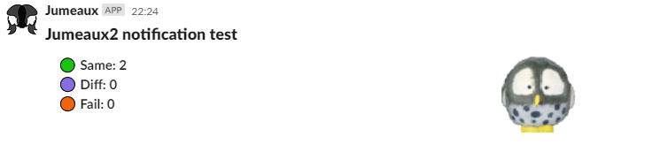
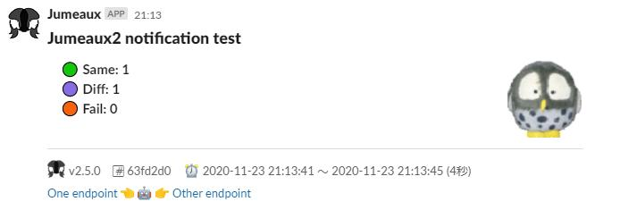

Notifier
========

通知設定の定義です。  
`Notifier`は`type`と`version`の値をもちます。

| Key     | Type         | Description          | Example | Default |
| ------- | ------------ | -------------------- | ------- | ------- |
| type    | NotifierType | 通知のタイプ         | slack   |         |
| version | (string)     | Notifierのバージョン | 1       | 1       |

これらの値によって以下の仕様が変わります。

* `Notifier`のプロパティ
* 環境変数

以降のセクションでは`${type}@v${version}`という表記で紹介します。  
たとえば、type=hoge, version=3の場合は`hoge@v3`となります。


:fontawesome-brands-slack: slack@v2
-------------------

### Environmental variables

| Name                        | Required | Description                   | Example                               |
| --------------------------- | -------- | ----------------------------- | ------------------------------------- |
| SLACK_INCOMING_WEBHOOKS_URL | yes      | [Incoming Webhook]のURL       | https://hooks.slack.com/services/xx.. |
| SLACK_THREAD_TS             | no       | レスするスレッドの`thread_ts` | 1605793970.186200                     |

!!! warning "古いWebhook URLはサポートしていません"
    json payloadでchannelなど上書き可能だった古いIncoming Webhook URLはサポートしていません。  
    新しいIncoming Webhook URLを使用してください。
    
    ※ 動作確認していないだけで動く可能性はありますが保証しません

### Definitions

| Key        | Type   | Description             | Example | Default |
| ---------- | ------ | ----------------------- | ------- | ------- |
| use_blocks | (bool) | [Block Kit]を使うかどうか | true    | false   |

`use_blocks: true`のとき、通知メッセージに[Block Kit]の`blocks[]`をjson文字列として指定すると[Block Kit]のUI表現を使って通知できます。

### Examples

#### SlackのBlodk Kit方式で通知するNotifier

```yaml
type: slack
version: 2
use_blocks: true
```


### Block Kitを使ったメッセージの構築について

[Block Kit]の構築には[Block Kit Builder]が便利です。


[Block Kit Builder]で作成したJSONの`blocks[]`を切り出し、notifierを使うアドオンのメッセージに指定しましょう。  
[final/notify]の場合は以下のように指定します。  
YAMLのヒアドキュメント`>-`を使うことでjsonをそのまま挿入できるのがポイントですね。

```yaml
// 中略
notifiers:
  jumeaux:
    type: slack
    version: 2
    use_blocks: true

addons:
  final:
    - name: notify
      config:
        notifies:
          - notifier: jumeaux
            message: >-
              [
                  {
                      "type": "header",
                      "text": {
                          "type": "plain_text",
                          "text": "{{ title }}"
                      }
                  },
                  {
                      "type": "section",
                      "text": {
                          "type": "mrkdwn",
                          "text": "　🟢 *Same: {{ summary.status.same }}*\n*　🟣 Diff: {{ summary.status.different }}*\n*　🟠 Fail: {{ summary.status.failure }}*"
                      },
                      "accessory": {
                          "type": "image",
                          "image_url": "https://avatars1.githubusercontent.com/u/9500018?s=160&v=4",
                          "alt_text": "alt text for image"
                      }
                  }
              ]
```

通知は以下のようになります。



もう少し情報を充実させた例も紹介します。

```yaml
// 中略
notifiers:
  jumeaux:
    type: slack
    version: 2
    use_blocks: true

addons:
  final:
    - name: notify
      config:
        notifies:
          - notifier: jumeaux2
            message: >-
              [
                {
                  "type": "header",
                  "text": {
                    "type": "plain_text",
                    "text": "{{ title }}"
                  }
                },
                {
                  "type": "section",
                  "text": {
                    "type": "mrkdwn",
                    "text": "　🟢 *Same: {{ summary.status.same }}*\n*　🟣 Diff: {{ summary.status.different }}*\n*　🟠 Fail: {{ summary.status.failure }}*"
                  },
                  "accessory": {
                    "type": "image",
                    "image_url": "https://avatars1.githubusercontent.com/u/9500018?s=160&v=4",
                    "alt_text": "alt text for image"
                  }
                },
                {
                  "type": "divider"
                },
                {
                  "type": "context",
                  "elements": [
                    {
                      "type": "image",
                      "image_url": "https://tadashi-aikawa.github.io/jumeaux/img/logo-large.png",
                      "alt_text": "jumeaux"
                    },
                    {
                      "type": "mrkdwn",
                      "text": "v{{ version }}"
                    },
                    {
                      "type": "mrkdwn",
                      "text": "#️⃣ {{ key[:7] }}"
                    },
                    
                    {
                      "type": "mrkdwn",
                      "text": "🏷️️ `{{ x }}`"
                    },
                    
                    {
                      "type": "mrkdwn",
                      "text": "⏰ {{ summary.time.start[:19] | replace('T', ' ') }} ～ {{ summary.time.end[:19] | replace('T', ' ') }} ({{ summary.time.elapsed_sec }}秒)"
                    },
                    {
                      "type": "mrkdwn",
                      "text": "<{{ summary.one.host }}|{{ summary.one.name }}> 👈 🤖 👉 <{{ summary.other.host }}|{{ summary.other.name }}>"
                    }
                  ]
                }
              ]
```

このようになります。




:fontawesome-brands-slack: slack@v1
-------------------

!!! danger "Deprecated"
    version=1は非推奨であり、v3.0のリリースで廃止予定です。  
    version=2を使ってください。

### Environmental variables

| Name                        | Required | Description             | Example                               |
| --------------------------- | -------- | ----------------------- | ------------------------------------- |
| SLACK_INCOMING_WEBHOOKS_URL | yes      | [Incoming Webhook]のURL | https://hooks.slack.com/services/xx.. |


### Definitions

| Key        | Type                          | Description          | Example                     | Default |
| ---------- | ----------------------------- | -------------------- | --------------------------- | ------- |
| channel    | string                        | 通知先               | `#times_test`               |         |
| username   | (string)                      | 通知ユーザ名         | jenkins                     | jumeaux |
| icon_emoji | (string)                      | アイコンの絵文字     | smile                       |         |
| icon_url   | (string)                      | アイコンのURL        | `http://jumeaux/images.img` |         |

### Examples

#### Slackの`#times_test`チャンネルに通知するNotifier

```yaml
type: slack
channel: "#times_test"
icon_emoji: "innocent"
```

[Incoming webhook]: https://api.slack.com/incoming-webhooks
[Block Kit]: https://api.slack.com/block-kit
[Block Kit Builder]: https://app.slack.com/block-kit-builder
[final/notify]: ../../addons/final#notify
